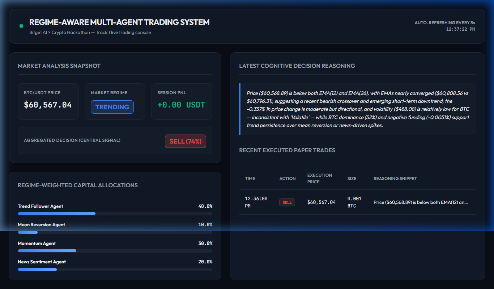

# Regime-Aware Multi-Agent Trading System

An autonomous, multi-agent crypto trading system that dynamically classifies market regimes using the Alibaba Qwen LLM and distributes capital allocations accordingly for spot paper trading on Bitget.

---

## 📊 System Architecture

```text
               +----------------------------------------+
               |  Market & On-Chain Data Feeds          |
               |  (Bitget Candles, Funding Rate + Dune) |
               +----------------------------------------+
                                    |
                                    v
               +----------------------------------------+
               |   MarketRegimeDetector (Qwen-Plus)     |
               |   -> Classifies: Trending/Sideways/Vol |
               |   -> Generates Allocations / Weights   |
               +----------------------------------------+
                                    |
            +-----------------------+-----------------------+
            |                       |                       |
            v                       v                       v
+-----------------------+ +-----------------------+ +-----------------------+
|  Trend Follower Agent | | Mean Reversion Agent  | |    Momentum Agent     |
|   (EMA Crossover)     | |      (RSI-14)         | |   (Volume Z-score)    |
+-----------------------+ +-----------------------+ +-----------------------+
            |                       |                       |
            +-----------------------+-----------------------+
                                    |
                                    v
                     +-----------------------------+
                     |    News Sentiment Agent     |
                     |  (Qwen qualitative parsing) |
                     +-----------------------------+
                                    |
                                    v
                     +-----------------------------+
                     |   Central Orchestrator      |
                     |   (Weighted Signal Blend)   |
                     +-----------------------------+
                                    |
                                    v
                     +-----------------------------+
                     |    Trade Execution Engine   |
                     |  (Bitget Order Placement &   |
                     |   Drawdown Circuit Breaker) |
                     +-----------------------------+
                                    |
                                    v
                     +-----------------------------+
                     |    Web Dashboard Console    |
                     |  (Live stats, trades, PnL)  |
                     +-----------------------------+
```

---

## 🛠️ How It Works

* **Data Aggregation:** The system fetches the last 100 hourly candles and the current futures funding rate directly from Bitget, and pulls broader on-chain sentiment/metrics (like BTC dominance) from Dune Analytics (falling back to a baseline of 52% if queries fail).
* **LLM Regime Detection:** A centralized `MarketRegimeDetector` processes the technical snapshots and inputs them to the **Alibaba Qwen LLM (`qwen-plus`)**. Qwen classifies the market state into one of three regimes: *Trending*, *Sideways*, or *Volatile*, and outputs agent capital allocation weights that sum to exactly 1.0.
* **Specialist Sub-Agents:** Four trading agents execute their specific logic concurrently:
  * **Trend Agent:** Monitors EMA 20/50 crossovers.
  * **Mean Reversion Agent:** Analyzes Wilder's RSI-14 over oversold/overbought thresholds.
  * **Momentum Agent:** Detects volume spikes using standard deviation Z-scores over a 24-hour window.
  * **News Agent:** Uses Qwen to qualitatively parse recent market headlines and sentiment.
* **Weighted Aggregation:** The `Orchestrator` multiplies each agent's trade signal (`BUY = +1`, `SELL = -1`, `HOLD = 0`) by their regime-defined capital weight and confidence score. If the aggregate score is $> 0.2$, the system issues a `BUY` order; if $< -0.2$, a `SELL` order; else a `HOLD`.
* **Execution & Circuit Breaker:** The `Executor` translates central decisions into spot orders (placing orders of `0.001 BTC` size) using manual HMAC-SHA256 request signatures. It tracks total session equity and immediately halts all trading if a drawdown of $> 5\%$ is hit.
* **Live Web Console:** An inline Express-served frontend displays the current regime, live price feeds, active agent weight distributions, raw Qwen cognitive reasoning, and full historical execution logs.

---

## 🧰 Tech Stack

* **Core Language & Runtime:** Node.js, TypeScript
* **Exchange Integrations:** Raw Bitget REST Spot v2 API (raw HTTP clients, no external SDKs)
* **AI Cognitive Processing:** Alibaba Cloud DashScope / Qwen API (`qwen-plus` model)
* **On-Chain Analytics:** Dune Analytics API
* **Web Interface:** Express.js, Vanilla CSS, and native HTML templates
* **Multi-Chain Expansion Plans:** Designed for cross-chain execution capabilities, including Solana spot/perps order placement and SPL token tracking.

---

## 🚀 Setup & Installation

### 1. Clone & Install Dependencies
```bash
git clone <your-repository-url>
cd regime
npm install
```

### 2. Configure Environment Variables
Create a `.env` file in the root directory and configure your API credentials:
```env
BITGET_API_KEY=your_bitget_api_key_here
BITGET_API_SECRET=your_bitget_api_secret_here
BITGET_PASSPHRASE=your_bitget_passphrase_here

DASHSCOPE_API_KEY=your_dashscope_api_key_here
DASHSCOPE_BASE_URL=https://dashscope.aliyuncs.com/compatible-mode/v1

DUNE_API_KEY=your_dune_api_key_here
```

### 3. Running the System
Start the main autonomous execution loop and the live web dashboard:
```bash
npm run start
```
Open **[http://localhost:3000](http://localhost:3000)** in your browser to view the real-time trading console.

---

## 🖥️ Live Dashboard Preview

Here is a preview of the console displaying active market analysis and autonomous order placements:



---

## 📈 Demo Results

During testing cycles:
* **Regime Detected:** Sideways & Trending regimes were successfully classified by `qwen-plus` with high confidence based on EMA convergence and funding rate.
* **Agent Collaboration:** Under *Trending* conditions, capital weights shifted heavily to the Trend Agent (40%) and Momentum Agent (30%), successfully aligning with the EMA crossover signal to trigger a market `SELL` order.
* **Execution Verification:** Spot orders were correctly signed, authorized, and dispatched to Bitget's servers, returning accurate status codes.
